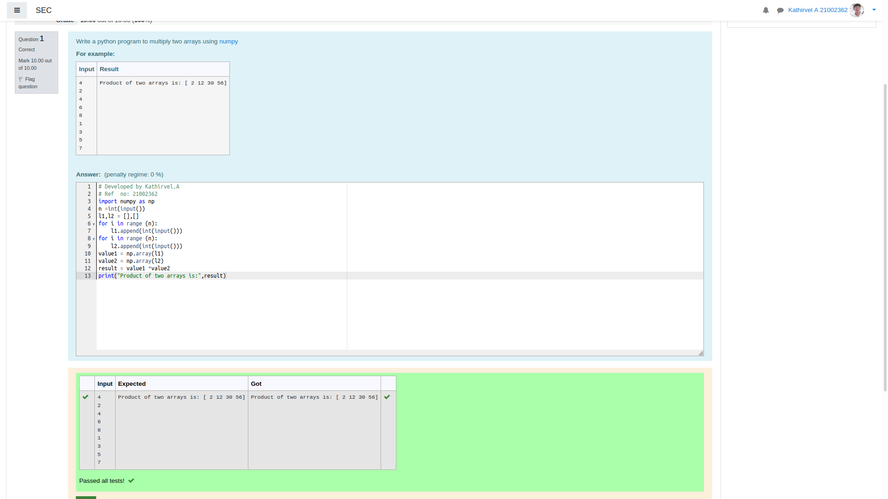

# Multiplying-two-matrix

## AIM:

## ALGORITHM:

### Step 1:

Use import numpy as np.
### Step 2:

Enter the input.
### Step 3:

Use append().
### Step 4:

Use * to multiply two matrix.
### Step 5:

Print.

## PROGRAM: 
~~~
# Developed by Kathirvel.A
# Ref  no: 21002362

import numpy as np
n =int(input())
l1,l2 = [],[]
for i in range (n):
    l1.append(int(input()))
for i in range (n):
    l2.append(int(input()))
value1 = np.array(l1)
value2 = np.array(l2)
result = value1 *value2
print("Product of two arrays is:",result)
~~~

## OUTPUT:

## RESULT:
Thus the program is written to multiply two matrix.

